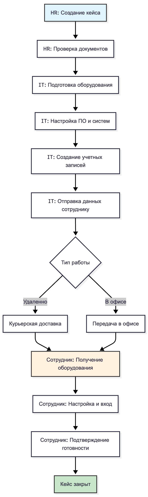

# Домашнее задание по теме «Интерфейс административной панели: заведение кейсов и эталонных решений»
### Шаги:
* Финализировать форму «Создать кейс» с UX-деталями.
* Проработать шаблон эталонного решения (структура: Контекст, Диагностика, Шаги, Метрики, Версии).
* Составить список минимум из 5 событий для аудита (например:solution.review.requested).

## Кейс "Система онбординга новых сотрудников в компании". Интерфейс административной панели для HR
### Задание 1. Форма для HR-менеджера при поступлении запроса от нового сотрудника
| Поле | Тип поля | Обязательность | Подсказка / Валидация | UX-детали |
| :--- | :--- | :--- | :--- | :--- |
| **Заголовок кейса** | Текстовое поле | ☑ | "Кратко опишите проблему" | Автозаполнение при выборе эталонного решения. Макс. 100 символов. |
| **Сотрудник** | Поиск + выпадающий список | ☑ | "Найдите сотрудника" | Поиск по ФИО, email. Подтягивает должность и дату выхода. |
| **Должность/Отдел** | Текстовое поле (readonly) | - | - | Заполняется автоматически при выборе сотрудника. |
| **Описание проблемы** | Многострочное текстовое поле | ☑ | "Подробно опишите запрос сотрудника..." | Поддержка Markdown для форматирования. |
| **Тип запроса** | Радио-кнопки | ☑ | - | Варианты: `Проблема с доступом`, `Вопрос по оплате`, `Необходимость оборудования`, `Орг. вопросы`, `Другое`. |
| **Приоритет** | Радио-кнопки | ☑ | - | Варианты: `Низкий`, `Средний`, `Высокий`, `Критичный`. Автоприоритет для типов "Проблема с доступом". |
| **Теги** | Мультиселект с тегами | ☑ | "Выберите теги" | Варианты: `IT`, `Бухгалтерия`, `Оборудование`, `Документы`, `Срочно`, `Удаленка`. |
| **Связанные решения** | Поиск + выпадающий список | - | "Найдите эталонное решение" | Сайдпанель с поиском по шаблонам. При выборе подтягивает шаги в описание. |
| **Исполнитель** | Выпадающий список | - | "Назначьте исполнителя" | Список HR/IT/бухгалтеров. Фильтрация по отделам. |
| **Вложения** | Загрузка файлов | - | "До 3 файлов, макс. 5 Мб каждый" | Для сканов заявлений, скриншотов ошибок. |
| **Статус кейса** | Выпадающий список | ☑ | - | Значения: `new` → `triage` → `in_progress` → `resolved` → `closed`. |
| **Кнопка «Создать кейс»** | Кнопка | ☑ | - | Неактивна, пока не заполнены обязательные поля. Валидация email сотрудника. |

### Задание 2. Эталонное решение. Выдача оборудования и настройка доступов для нового сотрудника
**Заголовок:** Выдача корпоративного ноутбука и настройка удаленного доступа для нового сотрудника

**Контекст:**

* Новый сотрудник вышел на работу (или работает удаленно)

* Ему необходим корпоративный ноутбук для начала работы

* Требуется настроить доступ к корпоративным системам (почта, мессенджеры, внутренние порталы)

* Процесс инициируется HR-менеджером после подписания договора

**Диагностика:**

* Теги кейса: `IT`, `Оборудование`, `Удаленка`, `Доступы`, `Онбординг`

* Ключевые фразы: "нет ноутбука", "не могу зайти в почту", "нужен доступ к Jira", "работаю удаленно", "не настроено рабочее место"

* Обязательные данные: ФИО сотрудника, должность, тип ОС (Windows/macOS/Linux), адрес доставки (для сотрудников, работающих удаленно), дата выхода на работу

**Шаги решения:**
 

**Детализация шагов:**

1. **HR-менеджер:**

* Убедиться, что подписан договор и заявление сотрудника

* Создать заявку в отдел IT через систему (кейс)

* Указать все необходимые данные сотрудника и требования к оборудованию

2. **IT-специалист:**

* Подготовить оборудование согласно стандартной конфигурации для должности

* Установить ОС, антивирус, корпоративный VPN, обязательный софт

* Создать учетные записи: корпоративная почта, мессенджер, доступы к внутренним системам

* Отправить сотруднику логин и временный пароль через безопасный канал

* Организовать передачу оборудования (курьер/офис)

3. **Сотрудник:**

* Получить оборудование

* Войти во все системы, сменить временный пароль

* Подтвердить получение и успешную настройку через форму обратной связи

**Метрики:**

* Среднее время от создания кейса до выдачи оборудования (цель: ≤3 рабочих дня)

* Количество кейсов "Оборудование" в месяц

* % сотрудников, у которых не возникло проблем с доступом в первый день (цель: ≥95%)

* Время настройки одного рабочего места (цель: ≤4 часа)

**Версии:**

* **v2.1 (2025-05-15)**: Добавлен чек-лист предустановленного ПО для разных отделов

* **v2.0 (2025-03-10)**: Добавлена инструкция для удаленных сотрудников

* **v1.0 (2025-01-20)**: Первоначальная версия решения
